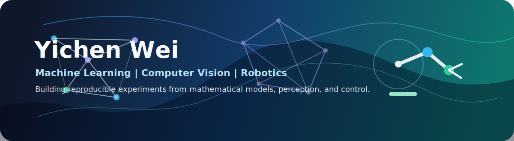

<p align="center">
  
</p>

<div align="center">

[](https://github.com/vicw477777)
[](https://www.linkedin.com/in/yichen-wei-vicky)
[](mailto:vicky_wei_yichen@outlook.com)

**Open to ML engineering, computer vision, robotics, and AI research engineering roles.**

</div>

---

## Snapshot

I work across **machine learning, computer vision, probabilistic modelling, speech recognition, and robotics**. I like projects where the core challenge is translating mathematical ideas into reproducible experiments, reliable evaluation, and clear technical communication.

<table>
<tr>
<td width="33%">

### ML Systems

Deep learning workflows, model evaluation, representation learning, generative modelling, and CTC-based speech recognition.

</td>
<td width="33%">

### Perception

3D computer vision, camera geometry, visual reasoning, and experiment-driven analysis of perception pipelines.

</td>
<td width="33%">

### Robotics

Robot dynamics, control, reinforcement learning foundations, and human-robot interaction concepts.

</td>
</tr>
</table>

<p align="center">
  
  
  
  
  
  
</p>

## Project Portfolio

<table>
<tr>
<td width="50%">

### [TIMIT Speech Recognition Using CTC](https://github.com/vicw477777/TIMIT-Speech-Recognition-Using-CTC)

Sequence modelling project for speech recognition with CTC-style acoustic modelling.

**Focus:** CTC training, sequence learning, speech evaluation.

</td>
<td width="50%">

### [3D Vision](https://github.com/vicw477777/computer_vision_3Dvision)

Computer vision project focused on 3D perception and geometric reasoning.

**Focus:** camera geometry, 3D reasoning, visual analysis.

</td>
</tr>
<tr>
<td width="50%">

### [Representation Learning and Generative Models](https://github.com/vicw477777/Representation-Learning-and-Generative-Models)

Deep learning project exploring latent representations and generative modelling.

**Focus:** representation learning, generative models, experiment comparison.

</td>
<td width="50%">

### [Gaussian Processes](https://github.com/vicw477777/ProbabilisticML_Gaussian-Processes)

Probabilistic ML project covering Gaussian processes and uncertainty-aware prediction.

**Focus:** kernels, Bayesian modelling, uncertainty.

</td>
</tr>
<tr>
<td width="50%">

### [Probabilistic Ranking](https://github.com/vicw477777/ProbabilisticML_Probabilistic-Ranking)

Probabilistic modelling project focused on ranking and preference-style inference.

**Focus:** ranking models, probabilistic inference, interpretation.

</td>
<td width="50%">

### [Robot Dynamics and Control](https://github.com/vicw477777/Robotics_Fundamentals-of-robot-dynamics-and-control)

Robotics fundamentals project covering dynamics and control reasoning.

**Focus:** kinematics, dynamics, control, robotics foundations.

</td>
</tr>
</table>

## Working Style

```text
read the model -> build the experiment -> inspect failures -> explain the result
```

I am strongest in work that needs both mathematical understanding and implementation discipline: reading papers or specifications, building experiments, debugging models, and communicating results clearly.

## Contact

<p align="center">
  <a href="https://github.com/vicw477777">GitHub</a>
  &nbsp;|&nbsp;
  <a href="https://www.linkedin.com/in/yichen-wei-vicky">LinkedIn</a>
  &nbsp;|&nbsp;
  <a href="mailto:vicky_wei_yichen@outlook.com">Email</a>
</p>

<div align="center">

For recruiters: the best starting points are the speech recognition, 3D vision, probabilistic ML, and robotics projects above.

</div>
